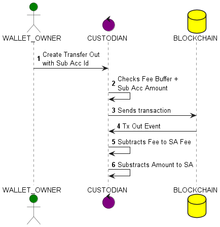
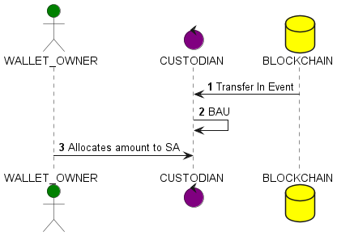

# Digital Virtual Account Specification

02/02/2024

tj@zodia.io

## Intro

A virtual account is a concept that allows to manage sub-accounts from a main account.  
In the digital asset space, a wallet W (such as BTC, or ETH), the main account, has a one-to-many
relationship with sub-accounts.   
Each sub-account acts as a virtual wallet.

## Naming
- W stands for Wallet
- $W_a$ is the total amount for W
- SA stands for Sub-Account
- $SA_i$ is the SA at index i
- $SA_i,a$ is the amount allocated for $SA_i$
- F is the fee buffer, also technically a SA
- U is the un-allocated SA

## Design
A SA is implemented in a database, a table that links the W id to the SA id:

Sub Account Table:

```postgres-sql
CREATE TABLE SubAccount (
    WalletId varchar(255) NOT NULL,
    SubAccountId varchar(255) NOT NULL,
    SubAccountName varchar(255),
    ExternalAddress varchar(255),
    Amount numeric(30),
    Signature varchar(255),
    PRIMARY KEY(WalletId, SubAccountId)
);
```

- *WalletId* is the W identifier of the underlying crypto-tech provider
- *SubAccountId* is the SA unique identifier, a SA is always linked to a W
- *SubAccountName* is a friendly name for the SA
- *ExternalAddress* is an optional external crypto address linked to the SA
- *Amount* is the amount allocated to the SA
- *Signature* is the digital signature of that table entry. A KMS key or Generic Signing can be used here.

- It is often necessary to manage fees at the SA level. By default, a fee SA is created.
- The sum of the amounts in the SAs is always <= to the wallet amount: $W_a \geq \sum_{i} (F_a + U_a + SA_i)$

## Endpoints

- Create SA: Creates a SA
- Allocate: Allocates un-allocated amounts to a SA
- De-allocated: Moves an amount from a SA to U
- Assign External Address: The External Address will be set by the SA legal owner

## Transfer Out Scenario
- On the UI, the wallet W owner creates an intent for a transfer out and adds the SA id.
- If no SA id is provided, it is a BAU process
- If the amount to transfer out exceeds the SA amount, the intent is rejected.
- An overdraft for F is allowed up to x
- Once the transfer out is successful, W's amount is updated (BAU), and the fee is subtracted from the F and the amount
subtracted from SA id.



## Transfer In Scenario
- On a Transfer In, BAU process
- The Wallet owner W will allocate the amount received to the appropriate Sub Account



## Auditing
All actions performed by the wallet owner are recorded.

## Reporting
Users can download reports

## Security
- Actions taken by the user from the website use the website authentication mechanism
- If required a Maker/Checker process is possible
- Server side endpoints use the API authentication mechanism
